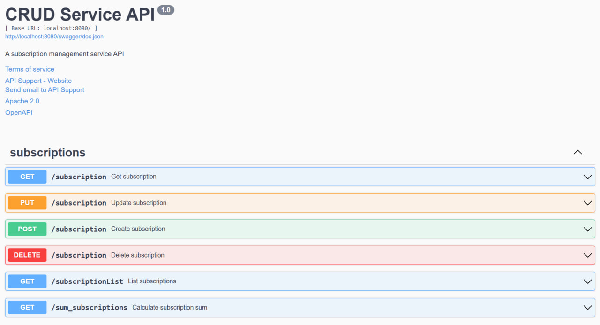
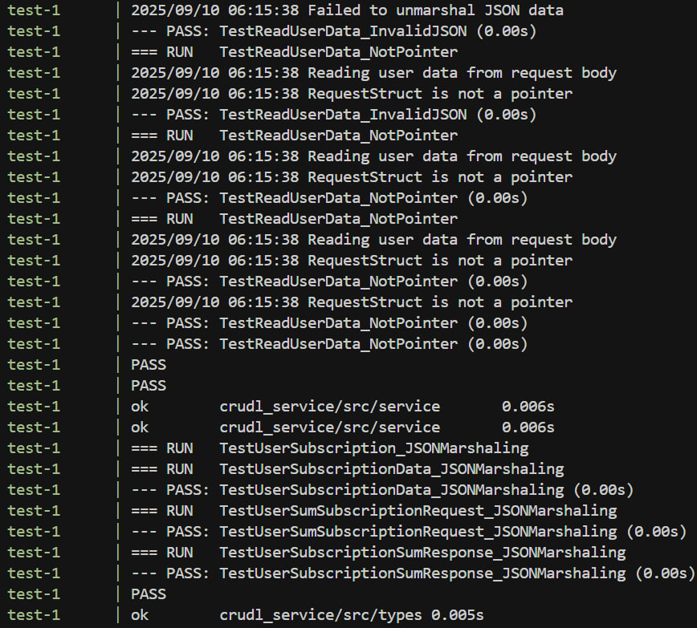

# CRUD Service API

Микросервис для управления подписками пользователей

## Скриншоты




## Запуск

```bash
docker-compose up --build
```

## Документация API

Swagger UI доступен по адресу: http://localhost:8080/swagger/index.html

Пример .env файла (нужно положить в корень проекта):
```
DB_HOST=postgres
DB_PORT=5432
DB_USER=postgres
DB_PASSWORD=postgres
DB_NAME=database
DB_SSL_MODE=disable
DB_PATH_MIGRATION=file:///app/src/db/migration
SERVER_HOST=localhost
HOST_PORT=8080
SERVER_PORT=8080
```
